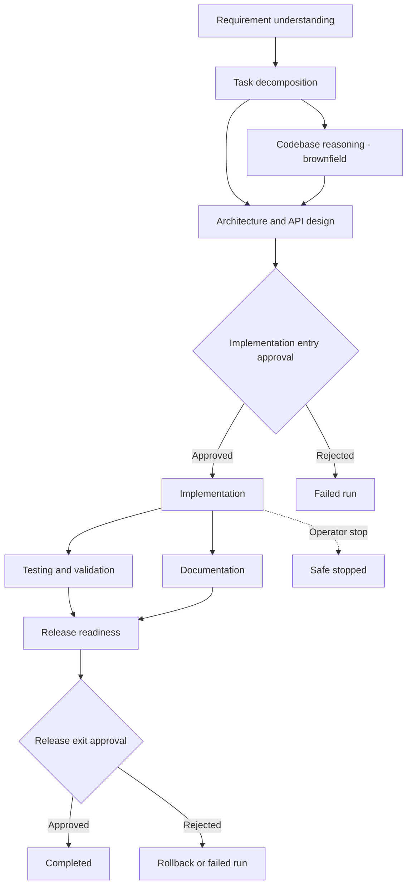

# Architecture

## 1. System overview

Two independent processes, each a self-contained JDK 21 application (no app server, no external
dependency jars):

```
┌─────────────────────────┐         REST          ┌──────────────────────────┐
│   orchestrator  :8080    │ ─────────────────────▶│   url-shortener  :8081    │
│                          │   (only in that the    │                          │
│  DAG engine + governance │   orchestrator's       │  create / redirect /     │
│  + reliability + agents  │   CODEBASE_REASONING   │  analytics / health      │
│                          │   stage reads its       │                          │
│  Claude API (optional)   │   filesystem, not its   │  in-memory repositories  │
│  ◀── HTTPS ──────────────┼── HTTP API)             │                          │
└─────────────────────────┘                         └──────────────────────────┘
```

The orchestrator does not call the url-shortener's HTTP API at runtime — it reasons about the
url-shortener's **source code on disk** (for brownfield's `CODEBASE_REASONING` stage) and produces
engineering artifacts (design docs, task lists, test plans, documentation, code excerpts) as its
output. This mirrors reality: an SDLC orchestrator's product is engineering work product, not
traffic against the system it's changing.

## 2. The orchestrator: package map

```
com.schwab.orchestrator
├── graph          StageId, GateType, StageDefinition, DependencyGraph, GraphBuilder
├── model          RunRequest, RunState, ScenarioType, StageOutput, DecisionRecord,
│                   ApprovalRequest, CheckpointKind
├── execution       ExecutionContext, Run, ReplanEvent, ExecutionEngine   <- the core
├── agents          Agent, StageAgentResult, LlmBackedAgent, FallbackAgentEngine,
│                   CodebaseReasoningAgent, AgentRegistry
├── llm             ClaudeClient, PromptTemplates, LlmUnavailableException
├── governance       PolicyGuardrail, GuardrailResult, GovernanceEngine,
│                   SecurityGuardrail, ComplianceGuardrail, ChangeControlGuardrail
├── reliability      RetryPolicy, RollbackAction/Registry, SafeStopController,
│                   MetricsRegistry, ReplanningEngine
├── audit           AuditEvent, AuditLogger
├── store           RunStore
├── api             OrchestratorController (REST surface)
└── framework       Json, Router, HttpCtx, WebServer, ApiException  (hand-rolled, see docs/SETUP.md)
```

`OrchestratorApp.main` is the composition root: it wires one `AgentRegistry`, one
`GovernanceEngine` (three guardrails), one `RollbackRegistry`, one `MetricsRegistry`, one
`AuditLogger`, and one `ReplanningEngine` into a single `ExecutionEngine`, then exposes it over
HTTP via `OrchestratorController`.

## 3. The dependency graph

One graph shape is used for every scenario type — greenfield, brownfield, and ambiguous are not
three hard-coded pipelines wearing different labels:



Policy guardrails run before every executable stage. An ambiguous requirement adds a gated
`CLARIFICATION` node between requirement understanding and task decomposition at runtime.

- **Non-linear**: TESTING and DOCUMENTATION depend only on IMPLEMENTATION and nothing else, so the
  engine schedules both the instant IMPLEMENTATION succeeds and runs them on separate virtual
  threads; RELEASE_READINESS is a join gate with an `ALL` policy (both must succeed) before it can
  run.
- **Stateful**: `DependencyGraph` and `Run` are mutable, in-memory, per-run objects — the graph for
  a specific run can differ from the template `GraphBuilder` produced (see re-planning below).
- **Entry/exit gates**: `StageDefinition.entryGate`/`exitGate` are independent of `dependsOn` —
  a stage can have its dependencies satisfied and still be blocked pending a human decision.
  IMPLEMENTATION has an *entry* gate (nothing is generated without approval); RELEASE_READINESS has
  an *exit* gate (its output exists, but isn't authoritative/"relied on downstream" — in this
  prototype, isn't allowed to complete the run — until sign-off).

### Dynamic re-planning

`CLARIFICATION` is never in the graph `GraphBuilder` initially produces. If
`REQUIREMENT_UNDERSTANDING`'s output has `ambiguous=true`, `ReplanningEngine.evaluateAfter` (called
immediately after that stage succeeds, before the graph is walked again) does two structural
mutations to the *live* graph:

1. `DependencyGraph.addStage(clarificationStage)` — inserts a new node depending on
   REQUIREMENT_UNDERSTANDING, itself gated by human approval.
2. `DependencyGraph.replaceStage(rewiredTaskDecomposition)` — replaces TASK_DECOMPOSITION's
   definition so its `dependsOn` now includes CLARIFICATION too.

The mutation is logged as a `ReplanEvent` (timestamp, triggering stage, reason, description of the
graph change) and is queryable via `GET /api/v1/runs/{id}` (`replans[]`). See
`scenarios/ambiguous/README.md` for a full worked trace. The mechanism generalizes — any stage's
`StageAgentResult` could in principle trigger a different re-plan; only the ambiguity trigger is
wired up today (see `docs/TESTING_AND_TRADEOFFS.md` for what a second trigger would look like).

## 4. Execution engine: the state machine

`ExecutionEngine.tick(Run)` is the entire scheduler, run under `Run`'s per-run monitor
(`stateLock()`). One pass:

1. If the run is terminal or safe-stop was requested, finalize and return.
2. For every stage in the graph, in status order: `RUNNING` stages just count toward "not done
   yet"; `SUCCEEDED`/`SKIPPED` stages with an unresolved exit gate open (or check) an approval
   checkpoint; `PENDING` stages whose dependencies are all satisfied are candidates.
3. For each candidate: resolve its entry gate if any (open a checkpoint and wait, or proceed if
   already approved) → evaluate all `PolicyGuardrail`s → if anything blocks, the whole run
   transitions to `BLOCKED_GUARDRAIL` and stops scheduling → otherwise mark the stage `RUNNING` and
   submit `executeStageWithRetry` to a virtual-thread executor.
4. If every stage is `SUCCEEDED`/cleared, finalize as `COMPLETED`; otherwise set the run state to
   `WAITING_APPROVAL` or `RUNNING` depending on what's outstanding.

`executeStageWithRetry` (runs off the lock, on its own virtual thread):

1. Calls the stage's `Agent` up to `StageDefinition.maxAttempts` times, with exponential backoff
   between attempts (`RetryPolicy`, capped at 5s so a demo run never stalls).
2. If every attempt fails, calls `FallbackAgentEngine` (deterministic, always available) instead of
   failing the stage outright.
3. If even the fallback throws, the stage is `FAILED`: `RollbackRegistry` is consulted for any
   already-succeeded stage this failure should roll back (e.g. TESTING failing permanently rolls
   IMPLEMENTATION back to "not done" — see `OrchestratorApp.main`), and the run is finalized
   `FAILED` or `ROLLED_BACK`.
4. On success, the result's decisions are appended to the run's shared `DecisionRecord` lineage,
   the `ReplanningEngine` gets a look at the new output, and `tick` is re-entered (Java monitors are
   reentrant, so this recursion is safe) to schedule whatever is now unblocked.

This is why TESTING and DOCUMENTATION genuinely execute concurrently rather than merely being drawn
side-by-side in a diagram: `tick` submits both to the executor in the same pass, and each runs to
completion independently before re-entering `tick` to check whether RELEASE_READINESS can proceed.

## 5. Governance: gates vs. guardrails (two different mechanisms, used together)

- **Gates** (`GateType.HUMAN_APPROVAL` on `StageDefinition`) are structural — the engine will not
  schedule a gated stage, or consider a gated stage's output final, without a resolved
  `ApprovalRequest`. This is "humans provide oversight, approvals, and final quality control" made
  mechanical.
- **Guardrails** (`PolicyGuardrail` implementations, run by `GovernanceEngine` before *every*
  candidate stage, not just gated ones) are automated policy checks: `SecurityGuardrail` blocks
  IMPLEMENTATION if the requirement text matches a denied pattern (e.g. "disable authentication");
  `ComplianceGuardrail` blocks RELEASE_READINESS unless TESTING and DOCUMENTATION both produced
  real artifacts; `ChangeControlGuardrail` independently re-checks that a human decision actually
  exists in the lineage for IMPLEMENTATION (defense in depth alongside the gate itself).

They compose deliberately: a human can approve the IMPLEMENTATION gate (as in
`scenarios/appendix-guardrail-block`) and the run is *still* blocked by `SecurityGuardrail`,
because gates model "did a human sign off," not "is this actually safe" — those are different
questions and the architecture keeps them as different mechanisms.

## 6. Reliability

- **Bounded retries**: every stage has a `maxAttempts` in its `StageDefinition` (2–3 in the current
  graph); backoff is exponential and capped.
- **Fallback**: `FallbackAgentEngine` is not a stub — it is a real, if simple, rule-based generator
  per stage (see `docs/TESTING_AND_TRADEOFFS.md` for why it exists and what it actually does,
  including genuine ambiguity detection via keyword/length heuristics).
- **Rollback**: `RollbackRegistry` maps a stage to a `RollbackAction`; today only
  `IMPLEMENTATION`'s rollback (triggered by `TESTING` failing permanently) is registered, as the
  concrete demonstration of the mechanism.
- **Safe-stop**: `SafeStopController` / `Run.requestSafeStop` sets a flag checked at the top of
  every `tick`; in-flight stage work is allowed to finish naturally (its result is simply discarded
  once the run is terminal) rather than interrupting a thread mid-call, to avoid leaving an external
  side effect half-applied.
- **Metrics**: `MetricsRegistry` tracks success rate, retry frequency, rollback frequency, MTTR
  (mean time between a stage's first failure and its eventual recovery via retry or fallback), and
  average end-to-end run latency — exposed at `GET /api/v1/metrics`. `scenarios/final_metrics_snapshot.json`
  is a real snapshot taken after the three required scenario runs plus the guardrail-block
  demonstration.

## 7. Observability / traceability

Three complementary views of the same run, all reconstructable after the fact:

- `GET /api/v1/runs/{id}/lineage` — the `DecisionRecord` list: who/what decided what, and why,
  across every stage (agent decisions, human approvals).
- `GET /api/v1/runs/{id}/audit` — the `AuditEvent` list: every attempt, retry, fallback, guardrail
  evaluation (pass *and* block), approval request/grant/reject, replan, and finalization, with
  timestamps. Also persisted to `audit-log/{runId}.jsonl` on disk (JSON-lines, one event per line)
  so it survives process restarts and is diffable/greppable like any other log.
- `GET /api/v1/runs/{id}/outputs` — the actual `StageOutput` per stage (summary, artifacts, risk
  flags, whether it needed human review, whether it used the fallback).

## 8. The url-shortener target service

Deliberately conventional layering so the orchestrator's design-stage output ("extend the existing
layers") has something real to point at:

```
controller/  → HTTP-facing, thin (ShortenController, RedirectController, AnalyticsController, HealthController)
service/     → business logic (UrlShortenerService, AnalyticsService, RateLimiterService, Base62Encoder)
repository/  → storage boundary (ShortUrlRepository interface + InMemoryShortUrlRepository, ClickEventRepository)
model/       → domain entities (ShortUrl, ClickEvent)
framework/   → the same hand-rolled HTTP/JSON layer as the orchestrator (see docs/SETUP.md)
```

APIs: `POST /api/v1/urls` (create, with optional custom alias + TTL), `GET /{code}` (302 redirect,
click recorded asynchronously so redirects are never slowed by analytics), `GET
/api/v1/urls/{code}` (metadata), `GET /api/v1/urls/{code}/analytics`, `DELETE /api/v1/urls/{code}`
(deactivate), `GET /health`. Reliability features: per-IP rate limiting on URL creation, TTL-based
expiration (410 Gone), collision-safe Base62 code generation (bounded retry loop), async click
recording via virtual threads.
